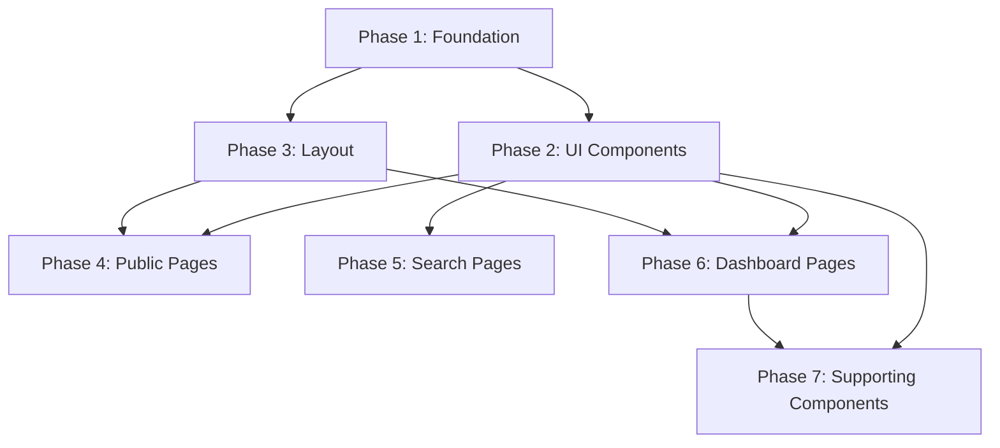

# MASAS UI Redesign — Implementation Plan

> **Scope:** Frontend-only. Modify `.jsx` and `.css` files only.  
> **Do NOT touch:** Backend code, API services, hooks, context files, routing logic.  
> **Design language:** Green-focused, Plus Jakarta Sans, vanilla CSS variables, clean & minimal.

---

## File Inventory (All files to modify or create)

| # | File | Action |
|---|------|--------|
| 1 | `src/index.css` | **Rewrite** — new design system, remove Tailwind |
| 2 | `src/main.jsx` | **Edit** — add font import |
| 3 | `src/App.jsx` | **Rewrite** — add Home route, update wrapper classes |
| 4 | `src/components/ui/Button.jsx` | **Rewrite** — CSS-class based |
| 5 | `src/components/ui/Card.jsx` | **Rewrite** — CSS-class based |
| 6 | `src/components/ui/StatusBadge.jsx` | **Rewrite** — with icons per spec |
| 7 | `src/components/ui/Modal.jsx` | **Rewrite** — CSS-class based |
| 8 | `src/components/ui/AlertBanner.jsx` | **Rewrite** — CSS-class based |
| 9 | `src/components/ui/EmptyState.jsx` | **Rewrite** — CSS-class based |
| 10 | `src/components/ui/PageHeader.jsx` | **Rewrite** — CSS-class based |
| 11 | `src/components/ui/LoadingState.jsx` | **Rewrite** — CSS-class based |
| 12 | `src/components/ui/SkeletonLoader.jsx` | **Rewrite** — CSS-class based |
| 13 | `src/components/ui/forms/Input.jsx` | **Rewrite** — CSS-class based |
| 14 | `src/components/ui/forms/TextArea.jsx` | **Rewrite** — CSS-class based |
| 15 | `src/components/ui/forms/Select.jsx` | **Rewrite** — CSS-class based |
| 16 | `src/components/ui/forms/FormField.jsx` | **Rewrite** — CSS-class based |
| 17 | `src/components/ui/forms/FormSection.jsx` | **Rewrite** — CSS-class based |
| 18 | `src/components/ui/forms/FormActions.jsx` | **Rewrite** — CSS-class based |
| 19 | `src/components/layout/Navbar.jsx` | **Rewrite** — full redesign per spec |
| 20 | `src/components/layout/Sidebar.jsx` | **Rewrite** — full redesign per spec |
| 21 | `src/pages/Home.jsx` | **Create** — new dedicated home page |
| 22 | `src/pages/Login.jsx` | **Rewrite** — centered card design |
| 23 | `src/pages/Register.jsx` | **Rewrite** — centered card design |
| 24 | `src/pages/Search.jsx` | **Rewrite** — two-column layout per spec |
| 25 | `src/pages/PublicPharmacy.jsx` | **Rewrite** — CSS-class based |
| 26 | `src/pages/dashboard/DashboardLayout.jsx` | **Rewrite** — sidebar + main area |
| 27 | `src/pages/dashboard/Dashboard.jsx` | **Rewrite** — metric cards, table, banner |
| 28 | `src/pages/dashboard/Inventory.jsx` | **Rewrite** — table card per spec |
| 29 | `src/pages/dashboard/Profile.jsx` | **Rewrite** — CSS-class based |
| 30 | `src/components/search/PharmacyCard.jsx` | **Rewrite** — per search spec |
| 31 | `src/components/search/MedicineCard.jsx` | **Rewrite** — CSS-class based |
| 32 | `src/components/inventory/MedicineModal.jsx` | **Rewrite** — CSS-class based |
| 33 | `src/components/dashboard/AiInsightCard.jsx` | **Rewrite** — CSS-class based |
| 34 | `src/components/dashboard/HealthScorePanel.jsx` | **Rewrite** — CSS-class based |
| 35 | `src/components/common/LoadingSpinner.jsx` | **Keep** — no change needed (delegates) |

---

## Phase 1: Foundation — Design System & Font

**Files:** `src/index.css`, `src/main.jsx`  
**Dependencies:** None  
**Estimated changes:** ~400 lines CSS, ~2 lines JSX

### 1a. Install font package
```bash
npm install @fontsource/plus-jakarta-sans
```

### 1b. `src/main.jsx` — add font import
Add `import '@fontsource/plus-jakarta-sans/400.css'` and weight variants (500, 600, 700).

### 1c. `src/index.css` — complete rewrite
Remove Tailwind `@import` and `@theme` block. Replace with:

- **CSS custom properties** on `:root`:
  - Green palette: `--green-50` through `--green-800`
  - Neutrals: `--slate-50`, `--border`, `--text`, `--muted`, `--light`
  - Semantic: `--warning-bg`, `--warning-text`, `--danger-bg`, `--danger-text`
  - Radius: `--radius-card: 10px`, `--radius-btn: 6px`, `--radius-pill: 20px`
  - Transitions: `--ease: cubic-bezier(0.16, 1, 0.3, 1)`, `--duration: 150ms`

- **Base resets**: box-sizing, margin, font-family, body bg/color, selection

- **Component classes** (all from `:root` tokens):
  - `.card` — white bg, 0.5px border, 10px radius, 16px padding
  - `.btn-primary` — green-600 bg, white text, 6px radius, hover green-700
  - `.btn-secondary` — white bg, border, muted text
  - `.btn-ghost` — transparent, muted text, hover bg
  - `.btn-danger` — red bg, white text
  - `.input-field` — slate-50 bg, border, 8px radius, focus green-500
  - `.badge-*` — stock badges with proper colors
  - `.page-bg` — slate-50 background
  
- **Layout classes**:
  - `.main-content` — flex column, min-height
  - `.navbar` — fixed, white, 56px height, border-bottom
  - `.sidebar` — fixed left, 180px wide
  - `.sidebar-pharmacy` — green-800 background
  - `.sidebar-admin` — #0f172a background
  
- **Table classes**: `.masas-table`, `.masas-th`, `.masas-td`, `.masas-tr`

- **Animations**: `@keyframes fadeIn`, `@keyframes spin`

- **Responsive**: `@media (max-width: 768px)` breakpoints

> [!IMPORTANT]
> This phase removes Tailwind. All subsequent phases must use CSS classes, not Tailwind utilities. The `cn()` helper from `lib/utils.js` still works for joining class names.

---

## Phase 2: Core UI Components

**Files:** All `src/components/ui/*.jsx` and `src/components/ui/forms/*.jsx`  
**Dependencies:** Phase 1  
**Estimated changes:** ~14 files

### 2a. `Button.jsx`
- Remove Tailwind variant/size maps
- Use CSS classes: `.btn`, `.btn-primary`, `.btn-secondary`, `.btn-ghost`, `.btn-danger`
- Size classes: `.btn-sm`, `.btn-md`, `.btn-lg`
- Keep `forwardRef`, `isLoading`, `leftIcon`, `rightIcon` API
- Replace `cn(layout, transitionControl, v, sizes[size])` → `cn('btn', variantClass, sizeClass)`

### 2b. `Card.jsx`
- Remove Tailwind utilities
- Use `.card` class with `.card-header`, `.card-content`, `.card-footer`
- Keep `interactive` prop (adds `.card-interactive` class)

### 2c. `StatusBadge.jsx`
- **Critical change**: Add icon support (CheckCircle, AlertTriangle, X icons)
- Stock badges must include icon + text per spec:
  - Available: green bg, checkmark icon
  - Low stock: amber bg, warning triangle icon
  - Out of stock: red bg, x icon
- Use CSS classes: `.badge`, `.badge-success`, `.badge-warning`, `.badge-danger`

### 2d. `Modal.jsx`
- Keep portal + a11y logic (escape, focus trap, scroll lock)
- Replace Tailwind → CSS classes: `.modal-backdrop`, `.modal-panel`, `.modal-header`
- Keep `ModalBody`, `ModalFooter` sub-components

### 2e. `AlertBanner.jsx`
- Use `.alert`, `.alert-error`, `.alert-success`, `.alert-warning`, `.alert-info`
- Keep icon + title + children API

### 2f. `EmptyState.jsx`
- Use `.empty-state` class
- Keep icon, title, description, action API

### 2g. `PageHeader.jsx`
- Use `.page-header` class
- Keep title, description, children API

### 2h. `LoadingState.jsx`
- Use `.loading-state` class
- Keep spinner animation

### 2i. `SkeletonLoader.jsx`
- Use `.skeleton` with CSS pulse animation

### 2j. Form components (`Input`, `TextArea`, `Select`, `FormField`, `FormSection`, `FormActions`)
- All use `.input-field`, `.textarea-field`, `.select-field` classes
- `FormSection` uses `.form-section` with `.form-section-header`
- `FormField` uses `.form-field` with `.form-label`
- `FormActions` uses `.form-actions`

---

## Phase 3: Layout Components

**Files:** `Navbar.jsx`, `Sidebar.jsx`, `DashboardLayout.jsx`, `App.jsx`  
**Dependencies:** Phase 1, Phase 2  
**Estimated changes:** ~4 files

### 3a. `Navbar.jsx` — full redesign
Per spec:
- White bg, 0.5px bottom border, 56px height, 24px horizontal padding
- **Left**: green dot (8px circle) + "MASAS" text (font-weight 600)
- **Center**: nav links 13px, muted color, hover → text color
- **Right (logged out)**: "Log in" text link + "Register pharmacy" green button
- **Right (pharmacy)**: pharmacy name + role badge + logout icon
- **Right (admin)**: "Admin" badge dark slate + logout icon
- **Mobile**: hamburger menu for center links

### 3b. `Sidebar.jsx` — full redesign
Per spec:
- **Pharmacy sidebar**: bg green-800, 180px width
  - Logo: green dot + "MASAS" white
  - Section labels: uppercase 9px, #86efac, letter-spacing 0.08em
  - Nav items: #bbf7d0, 11px, 8px padding, 6px radius
  - Active: green-700 bg, white text
  - Icons: 15px Lucide icons
  - Sections: Main (Overview, Inventory, Analytics), Account (Profile, Settings)
  - Bottom: Logout
- Component accepts `variant` prop: `'pharmacy'` (green) or `'admin'` (dark slate)

### 3c. `DashboardLayout.jsx`
- Sidebar (180px) + main content area (flex: 1)
- Main bg: slate-50
- Mobile: sidebar overlay with hamburger trigger

### 3d. `App.jsx`
- Add `Home` page import and route (currently redirects, need actual page)
- Update wrapper div to use `.app-shell` class instead of Tailwind
- Keep all existing routes and routing logic

---

## Phase 4: Public Pages — Home, Login, Register

**Files:** `Home.jsx` (new), `Login.jsx`, `Register.jsx`  
**Dependencies:** Phase 1, Phase 2, Phase 3  
**Estimated changes:** ~3 files

### 4a. `Home.jsx` — **CREATE NEW**
Full page with sections:
1. **Hero**: green-50 bg, centered
   - Badge pill: "Live medicine availability near you" with map-pin icon
   - H1: 36px bold "Find medicines at **nearby pharmacies** instantly"
   - Subtitle: 15px muted, max-width 480px
   - Search bar: white bg, green border, input + "Search" button
   - Sub-text: "Searching across verified pharmacies in your city"

2. **Stats row**: 3 columns, white bg
   - "1,200+ Verified pharmacies"
   - "50,000+ Medicines tracked"  
   - "< 2s Search time"

3. **Features section**: slate-50 bg, 3 feature cards in grid
   - Each card: green icon square + title + description
   - Features: Location-based search, Live stock status, Verified only

4. **How it works**: 3 numbered steps with connecting line
   - Green circles with white numbers

### 4b. `Login.jsx` — redesign
- Centered card on slate-50 bg, max-width 400px, padding 40px
- Green dot logo + "MASAS" + "Welcome back" title
- Inputs with labels above
- Full-width green "Sign in" button
- "Don't have an account? Register" link below

### 4c. `Register.jsx` — redesign
- Same card layout as Login
- Green dot logo + "MASAS" + "Create your account"
- Email, password, confirm password inputs
- Full-width green "Create account" button
- "Already have an account? Sign in" link below

---

## Phase 5: Search & Public Pharmacy Pages

**Files:** `Search.jsx`, `PublicPharmacy.jsx`, `PharmacyCard.jsx`, `MedicineCard.jsx`  
**Dependencies:** Phase 1, Phase 2  
**Estimated changes:** ~4 files

### 5a. `Search.jsx` — full redesign
Per spec:
- **Top bar**: white bg, border-bottom, search input + location indicator
- **Filter pills**: "All results", "Available only", "Within 2km", etc.
- **Two-column layout**: results list (flex:1) | right panel (240px)
- **Result cards**: medicine name + generic + stock badge, pharmacy info, price + distance + action button
- **Right panel**: map placeholder + nearby pharmacies list

### 5b. `PharmacyCard.jsx` — redesign per search result spec
- Top: medicine name (bold) + generic (muted) | stock badge with icon
- Middle: pharmacy name with store icon, address
- Bottom: price (green bold) | distance (muted) | action button

### 5c. `MedicineCard.jsx` — CSS class update

### 5d. `PublicPharmacy.jsx` — CSS class update

---

## Phase 6: Dashboard Pages

**Files:** `Dashboard.jsx`, `Inventory.jsx`, `Profile.jsx`  
**Dependencies:** Phase 1, Phase 2, Phase 3  
**Estimated changes:** ~3 files (large files)

### 6a. `Dashboard.jsx` — full redesign
Per spec:
- **Header**: "Good morning, [name]" 18px bold + pharmacy name + verified badge
- **Metric cards** (4): 
  - Total medicines (green icon)
  - Low stock (amber icon)
  - Out of stock (red icon)  
  - Expiring soon (purple icon)
- **Pending banner**: amber warning if pharmacy status is PENDING
- Keep existing data fetching, metrics, AI insights, timeline logic
- Replace all Tailwind classes with CSS classes

### 6b. `Inventory.jsx` — full redesign
Per spec:
- **Header**: "Inventory" title + "Add medicine" green button with plus icon
- **Table card**: Medicine (name + generic), Category, Qty, Price, Status badge, Expiry, Actions
- **Alternating row hover**
- **Empty state**: centered box icon + "No medicines added yet"
- Keep all data fetching, search, delete, modal logic

### 6c. `Profile.jsx` — CSS class update
- Use new form components
- Keep all form logic, submit handlers

---

## Phase 7: Supporting Dashboard Components

**Files:** `AiInsightCard.jsx`, `HealthScorePanel.jsx`, `MedicineModal.jsx`  
**Dependencies:** Phase 1, Phase 2  
**Estimated changes:** ~3 files

### 7a. `AiInsightCard.jsx` — CSS class update
### 7b. `HealthScorePanel.jsx` — CSS class update  
### 7c. `MedicineModal.jsx` — CSS class update

---

## Execution Order



> [!NOTE]
> Each phase is designed to be independently verifiable. After each phase, `npm run dev` should work without errors (though pages modified in later phases will still show old styling until their phase is completed).

---

## Key Design Decisions

1. **Tailwind removal**: We remove `@import "tailwindcss"` and `@theme` from `index.css`. The Tailwind Vite plugin stays in config (we don't touch `.js` config files) but becomes inert without the import directive.

2. **`cn()` utility retained**: The `clsx` + `twMerge` helper in `lib/utils.js` still works for joining CSS class names. `twMerge` passes through non-Tailwind classes unchanged.

3. **No `lib/ui-styles.js` imports**: New components won't import from this file. We don't delete it (it's a `.js` file), but nothing references it.

4. **Inline styles for dynamic values only**: CSS classes for all static styling; `style={{ width: percentage }}` only for computed values like progress bars.

5. **Home page**: Currently `App.jsx` has an inline `Home` function that redirects. We create a real `pages/Home.jsx` and update the route.
